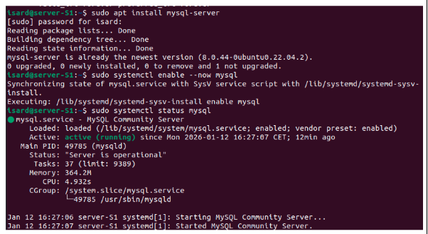
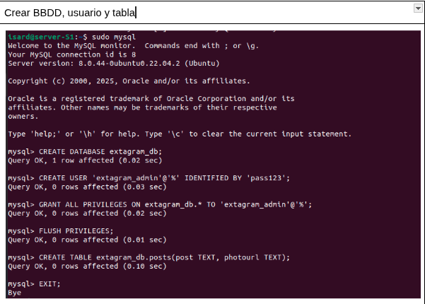
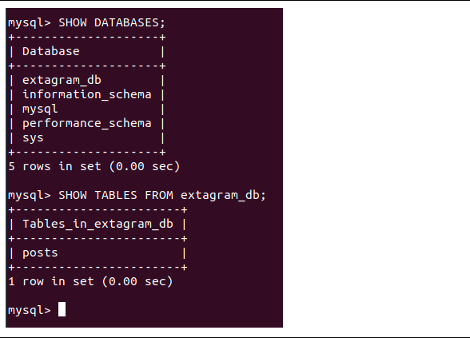
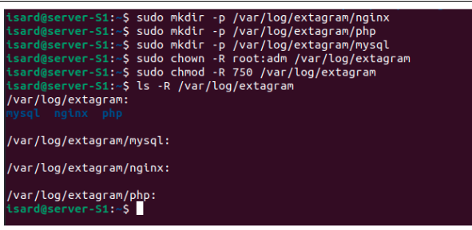
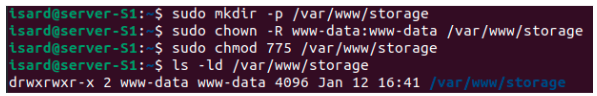

# Configuración de MySQL para Extagram (Explicación paso a paso)

---

## 1. Instalación y activación del servidor MySQL

En esta imagen se muestra la instalación del paquete `mysql-server` y la activación del servicio MySQL en el sistema.

---

## 2. Creación de la base de datos, usuario y tabla

Aquí se observa el proceso de creación de la base de datos `extagram_db`, el usuario `extagram_admin`, la asignación de privilegios y la creación de la tabla `posts`.

---

## 3. Comprobación de la base de datos y tabla

En esta captura se verifica que la base de datos y la tabla `posts` han sido creadas correctamente usando los comandos `SHOW DATABASES;` y `SHOW TABLES FROM extagram_db;`.

---

## 4. Creación de directorios para logs de MySQL, nginx y PHP

Se muestran los comandos para crear los directorios de logs para MySQL, nginx y PHP, así como la asignación de permisos y propietarios adecuados.

---

## 5. Creación y permisos del directorio de almacenamiento de imágenes

En esta imagen se muestra la creación del directorio `/var/www/storage` para almacenar las imágenes subidas, junto con la asignación de permisos y propietario.

---
