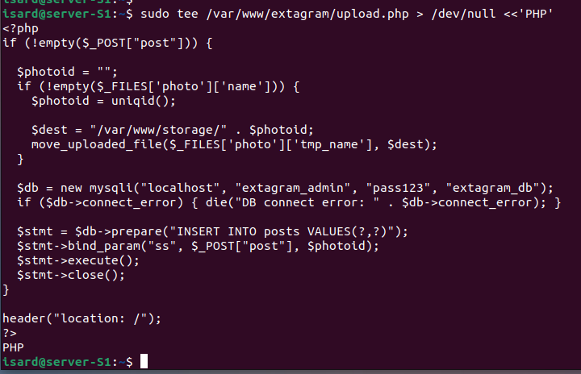
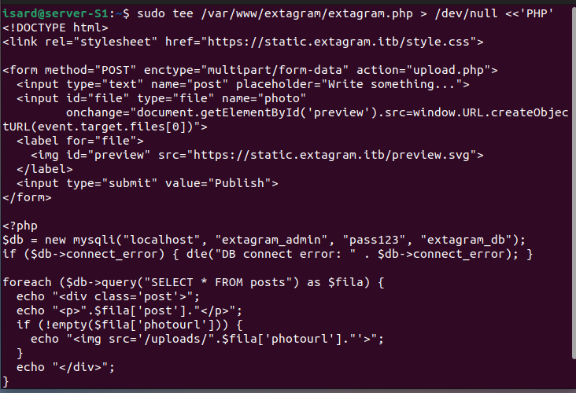
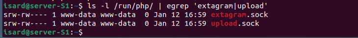
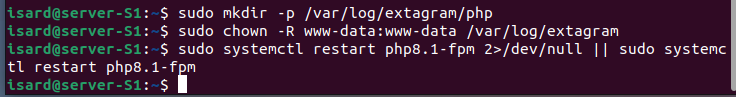
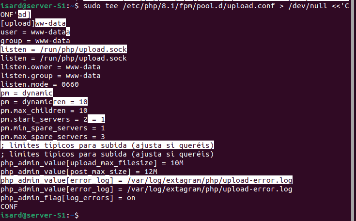
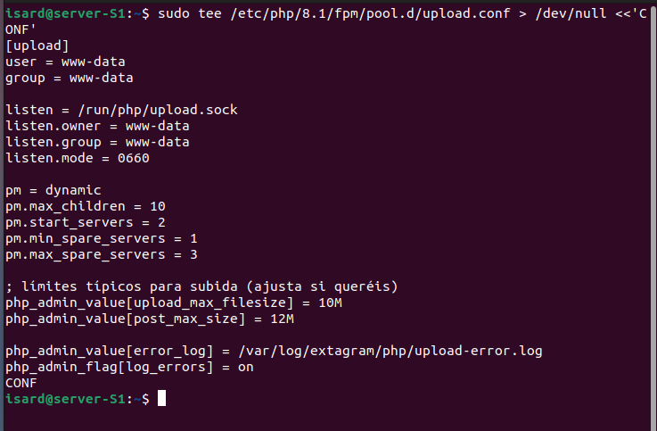
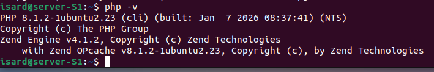
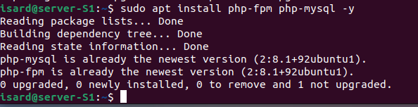

# Configuración de PHP-FPM y MySQL para Extagram (Explicación paso a paso)

---

## 1. Creación del script de subida (`upload.php`)

En esta imagen se muestra la creación del archivo `upload.php`, que permite subir imágenes y guardar posts en la base de datos MySQL. Se utiliza `mysqli` para la conexión y se gestionan los archivos subidos con `move_uploaded_file`.

---

## 2. Creación del script principal de la aplicación (`extagram.php`)

Aquí se observa el archivo principal `extagram.php`, que contiene el formulario para publicar posts y subir imágenes. También se conecta a la base de datos y muestra los posts existentes.

---

## 3. Verificación de los sockets de PHP-FPM

En esta captura se listan los sockets creados por PHP-FPM para los diferentes "pools" configurados (`extagram.sock` y `upload.sock`). Esto permite que Nginx se comunique con los procesos PHP de forma eficiente y segura.

---

## 4. Creación de directorios y permisos para logs

Se crean los directorios necesarios para los logs de PHP y se asignan los permisos adecuados al usuario `www-data`. Finalmente, se reinicia el servicio PHP-FPM para aplicar los cambios.

---

## 5. Configuración del pool `upload` en PHP-FPM

En esta imagen se muestra la configuración del pool `upload` en `/etc/php/8.1/fpm/pool.d/upload.conf`. Se definen parámetros como el usuario, el socket, los límites de subida y la ubicación de los logs de errores.

---

## 6. Configuración del pool `extagram` en PHP-FPM

Aquí se configura el pool `extagram`, similar al anterior, pero con su propio socket y archivo de log de errores. Esto permite aislar los procesos PHP de cada funcionalidad.

---

## 7. Verificación de la versión de PHP instalada

Se comprueba que la versión instalada de PHP es la 8.1, adecuada para el proyecto y compatible con las últimas características del lenguaje.

---

## 8. Instalación de los paquetes necesarios

Por último, se muestra la instalación de los paquetes `php-fpm` y `php-mysql`, necesarios para ejecutar PHP como servicio y conectar con MySQL.
