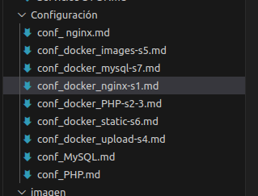
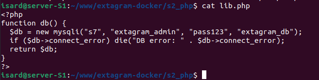

# S2/S3 - PHP Feed Application

## Descripción
S2 y S3 son contenedores PHP-FPM idénticos que forman el núcleo de Extagram. Reciben peticiones balanceadas desde nginx S1 para renderizar el feed principal, consultando posts desde MySQL S7 y mostrando formulario de publicación.

## Arquitectura
- **Imagen base:** php:8.2-fpm
- **Puerto interno:** 9000/tcp (FastCGI)
- **Volumen:** `./s2_php:/var/www/html`
- **Red:** extanet
- **Dependencias:** S7 (MySQL)

## Flujo de petición

---

## Archivos

### 1. Dockerfile

**Ubicación:** `s2_php/Dockerfile`

**Código:**

**Explicación:**
- `FROM php:8.2-fpm`: Imagen base PHP con FastCGI Process Manager
- `RUN docker-php-ext-install mysqli`: Instala extensión MySQLi para conectar a S7
- `WORKDIR /var/www/html`: Directorio de trabajo donde nginx busca PHP
- `COPY . .`: Copia todo el código fuente (lib.php, extagram.php)
- `RUN mkdir -p uploads avatars`: Crea directorios para fotos/avatars
- `chown -R www-data:www-data`: Permisos correctos para PHP-FPM

---

### 2. lib.php

**Ubicación:** `s2_php/lib.php`

**Código:**

**Explicación:**
- `function db()`: Función reutilizable que retorna conexión MySQLi activa
- `new mysqli("s7", ...)`: Conecta a contenedor S7 via DNS Docker (hostname `s7` resuelve a IP interna)
- **Credenciales:**
  - Host: `s7` (MySQL container)
  - User: `extagram_admin`
  - Password: `pass123`
  - Database: `extagram_db`
- `if ($db->connect_error) die(...)`: Manejo básico de errores de conexión
- `return $db`: Devuelve objeto mysqli para queries

---

### 3. extagram.php

**Ubicación:** `s2_php/extagram.php`

**Código:**

**Explicación:**

extagram.php es la página principal de Extagram donde los usuarios publican fotos con caption mediante formulario POST y visualizan feed de posts recientes ordenados por fecha desde MySQL.
