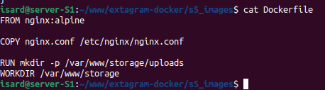

# S5 - Images Static Server

## Descripción
S5 sirve exclusivamente archivos de imagen estáticos (fotos subidas por usuarios) desde volumen persistente compartido con S4. Nginx optimizado sin PHP para máxima velocidad de carga.

## Arquitectura
- **Imagen base:** nginx:alpine (ligero, 5MB)
- **Puerto interno:** 80/tcp (HTTP estático)
- **Volumen:** `uploads_data:/var/www/storage/uploads` (compartido con S4)
- **Red:** extanet
- **Proxy desde:** S1 (rutas /uploads/ y /avatars/)

---

## Archivos

### 1. Dockerfile

**Ubicación:** `s5_images/Dockerfile`

**Código:**

**Explicación:**
- `FROM nginx:alpine`: Imagen nginx ultra-ligera basada en Alpine Linux (sin Ubuntu/Debian)
- `COPY nginx.conf /etc/nginx/nginx.conf`: Sobrescribe config por defecto con nuestra
- `RUN mkdir -p /var/www/storage/uploads`: Crea estructura directorios para montar volumen
- `WORKDIR /var/www/storage`: Establece directorio trabajo

---

### 2. nginx.conf

**Ubicación:** `s5_images/nginx.conf`

**Código:**

**Explicación:**

nginx.conf configura servidor HTTP en puerto 80 que sirve archivos estáticos desde /var/www/storage/uploads/, mapeando rutas /uploads/ y /avatars/ al mismo directorio mediante alias, con autoindex habilitado para listar contenido del volumen compartido.

