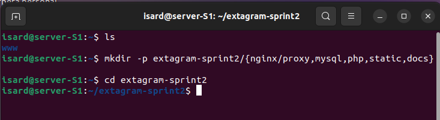
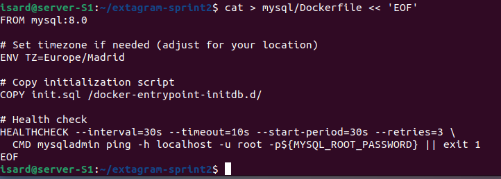
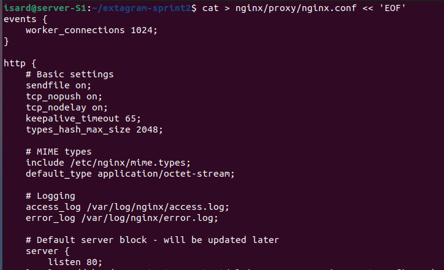
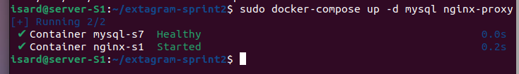
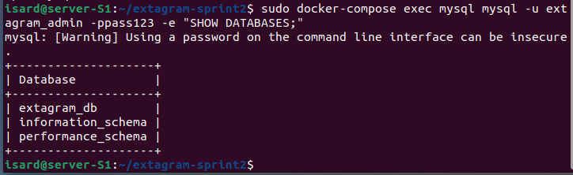

convert all this in markdown.md ```markdown
# Configuración y despliegue de MySQL con Docker

A continuación se explica, paso a paso y en español, el proceso de configuración y despliegue de MySQL usando Docker, siguiendo la estructura y estilo del PDF original en inglés.

---

# Configuración y despliegue de MySQL con Docker

A continuación se explica, paso a paso y en español, el proceso de configuración y despliegue de MySQL usando Docker, siguiendo la estructura y estilo del PDF original en inglés.

---

## 1. Crear la estructura de carpetas del proyecto



**Comando:**
```bash
mkdir -p extagram-sprint2/{nginx/proxy,mysql,php,static,docs}
cd extagram-sprint2
```

---

## 2. Crear el archivo de variables de entorno


**Comando:**
```bash
cat > .env << 'EOF'
# ... contenido ...
EOF
```
**Descripción:**  
Se define el archivo `.env` con las credenciales de la base de datos, nombre de red y servicios para Docker Compose.

---

## 3. Contenido del script de inicialización


**Descripción:**  
El script crea la base de datos `extagram_db`, el usuario `extagram_admin` con contraseña, otorga privilegios y crea la tabla `posts`.

---

## 4. Crear el script de inicialización de la base de datos


**Comando:**
```bash
cat > mysql/init.sql << 'EOF'
# ... contenido ...
EOF
```
**Descripción:**  
Se genera el script SQL que crea la base de datos, el usuario y la tabla necesaria para la aplicación.

---

## 5. Crear el Dockerfile personalizado para MySQL



**Comando:**
```bash
cat > mysql/Dockerfile << 'EOF'
# ... contenido ...
EOF
```
**Descripción:**  
Se crea un Dockerfile personalizado para MySQL, estableciendo la zona horaria, copiando scripts de inicialización y añadiendo un chequeo de salud.

---

## 6. Crear el archivo de configuración de Nginx



**Comando:**
```bash
cat > nginx/proxy/nginx.conf << 'EOF'
# ... configuración ...
EOF
```
**Descripción:**  
Se genera el archivo de configuración principal para Nginx, donde se definen parámetros básicos y el bloque del servidor.

---

## 7. Levantar los servicios MySQL y Nginx



**Comando:**
```bash
sudo docker-compose up -d mysql nginx-proxy
```
**Descripción:**  
Inicia los contenedores de MySQL y Nginx en segundo plano. El estado "Healthy" indica que MySQL está funcionando correctamente.

---

## 8. Verificar bases de datos en MySQL



**Comando:**
```bash
sudo docker-compose exec mysql mysql -u extagram_admin -ppass123 -e "SHOW DATABASES;"
```
**Descripción:**  
Este comando accede al contenedor de MySQL y muestra las bases de datos disponibles, verificando que `extagram_db` se ha creado correctamente.

---