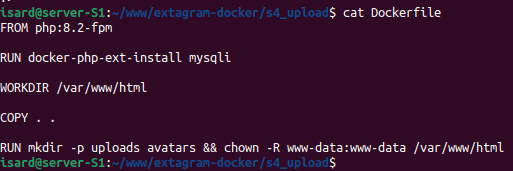
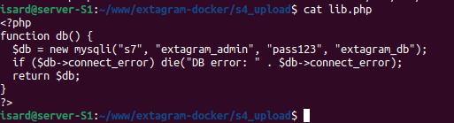
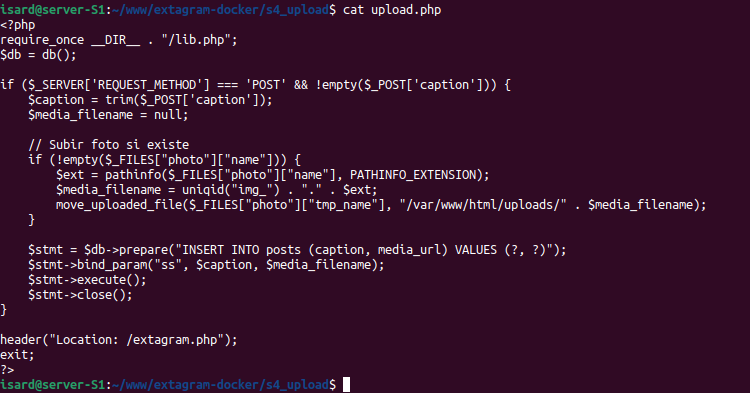

# S4 - PHP Upload Handler

## Descripción
S4 es el servicio especializado exclusivamente en procesar subidas de contenido multimedia. Recibe POST multipart/form-data con caption+foto desde formulario en S2/S3, guarda imágenes en volumen persistente y registra posts en MySQL S7.

## Arquitectura
- **Imagen base:** php:8.2-fpm
- **Puerto interno:** 9000/tcp (FastCGI)
- **Volumen:** `uploads_data:/var/www/html/uploads` (persistente)
- **Red:** extanet
- **Dependencias:** S7 (MySQL)

## Flujo de petición

---

## Archivos

### 1. Dockerfile

**Ubicación:** `s4_upload/Dockerfile`

**Código:**

**Explicación:**
- `FROM php:8.2-fpm`: Imagen base PHP FastCGI Process Manager
- `RUN docker-php-ext-install mysqli`: Extensión MySQLi para INSERT en S7
- `WORKDIR /var/www/html`: Directorio trabajo donde nginx busca upload.php
- `COPY . .`: Copia lib.php + upload.php al contenedor
- `RUN mkdir -p uploads avatars`: Crea directorios para almacenar fotos subidas
- `chown -R www-data:www-data`: Permisos escritura para PHP-FPM

---

### 2. lib.php

**Ubicación:** `s4_upload/lib.php`

**Código:**

**Explicación:**
Idéntico a S2/S3. Función `db()` retorna conexión MySQLi a contenedor S7 con credenciales `extagram_admin/pass123` sobre base de datos `extagram_db`.

---

### 3. upload.php

**Ubicación:** `s4_upload/upload.php`

**Código:**

**Explicación:**

upload.php procesa formularios POST con foto+caption, guarda imágenes en disco con nombres únicos, inserta registro en BD MySQL y redirige usuario al feed principal
