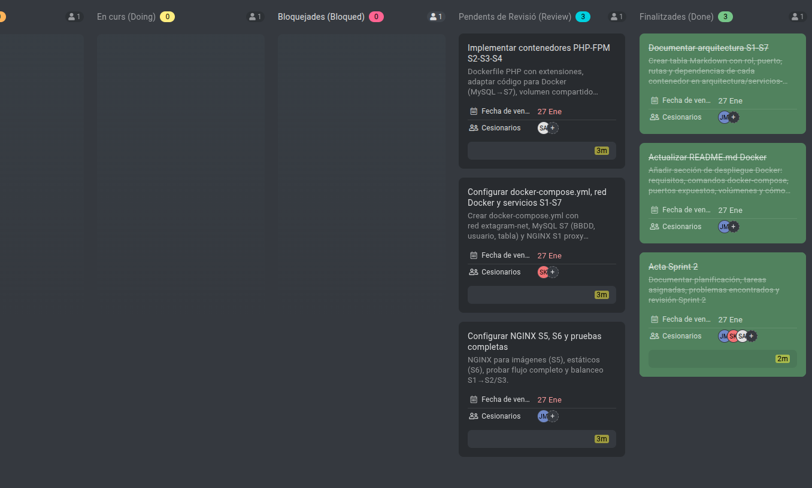

## Sprint 2

**Fecha:** 19/01/2026 - 27/01/2026

El día 19/01/2026 hemos realizado la segunda acta para nuestro proyecto. En esta acta participaron:

**Participantes:**  
- Scrum Master: Jan  
- Product Owner: Spandan
- Miembro: Anmol  

**Propósitos del Sprint 2:**  
Crear todos los Dockerfiles y configuraciones NGINX/PHP-FPM para los servicios S1-S7, documentar la arquitectura distribuida y asegurar que la página web Extagram funcione completamente en contenedores Docker con proxy inverso y balanceo de carga.  

## Tareas

**Actualizar README.md Docker**
Añadir sección de despliegue Docker: requisitos, comandos docker-compose, puertos expuestos, volúmenes y cómo parar/levantar servicios.

**Documentar arquitectura S1-S7**
Crear tabla Markdown con rol, puerto, rutas y dependencias de cada contenedor en arquitectura/servicios-S1-S7.md.

**Configurar docker-compose.yml, red Docker y servicios S1-S7**
Crear docker-compose.yml con red extagram-net, MySQL S7 (BBDD, usuario, tabla) y NGINX S1 proxy básico.

**Implementar contenedores PHP-FPM S2-S3-S4**
Dockerfile PHP con extensiones, adaptar código para Docker (MySQL→S7), volumen compartido imágenes S4-S5.

**Configurar NGINX S5, S6 y pruebas completas**
NGINX para imágenes (S5), estáticos (S6), probar flujo completo y balanceo S1→S2/S3.

# Acta Final del Sprint 2

**Fecha:** 27/01/2026

**Participantes:**
- Scrum Master: Jan
- Product Owner: Spandan
- Miembro: Anmol

---

## Objetivo de la Reunión
Revisión final del Sprint 2 para verificar el estado de las tareas planificadas, identificar qué se ha completado y analizar las causas de los pendientes, si los hubiera.

---

## Revisión de Tareas

### **5 tareas**

1. **Actualizar README.md Docker**  
   - **Responsable:** Jan  
   - **Fecha de finalización:** 27/01/2026  
   - **Estado:** COMPLETADO 

2. **Documentar arquitectura S1-S7**  
   - **Responsable:** Jan  
   - **Fecha de finalización:** 27/01/2026  
   - **Estado:** COMPLETADO 

3. **Configurar docker-compose.yml, red Docker y servicios S1-S7**  
   - **Responsable:** Spandan  
   - **Fecha de finalización:** 27/01/2026  
   - **Estado:** PENDIENTE 

4. **Implementar contenedores PHP-FPM S2-S3-S4**  
   - **Responsable:** Anmol  
   - **Fecha de finalización:** 27/01/2026  
   - **Estado:** PENDIENTE 

5. **Configurar NGINX S5, S6 y pruebas completas**  
   - **Responsable:** Jan  
   - **Fecha de finalización:** 27/01/2026  
   - **Estado:** PENDIENTE 

### **Pendientes de Revisión (Review) – 3 tareas**
tenemos tres tareas pendientes de revision por no poder comprovar que funcionan

---

## Conclusión del Sprint 2
En conclusión, consideramos que durante el Sprint 2 nos hemos centrado principalmente en la configuración de Docker, ya que se trata de una tecnología nueva para nosotros y ha sido necesario invertir más tiempo del previsto en su comprensión y puesta en marcha. Sin embargo, reconocemos que uno de los principales puntos a mejorar ha sido la documentación, ya que en este sprint no se ha documentado adecuadamente todo el trabajo realizado. Nos falta registrar varias configuraciones importantes, así como añadir más tareas en ProofHub y documentar los errores encontrados. Esto nos permitirá identificar con mayor claridad qué aspectos debemos mejorar en los próximos sprints. En resumen, nuestro principal objetivo de mejora es reforzar la documentación

---

# Captura ProofHub

