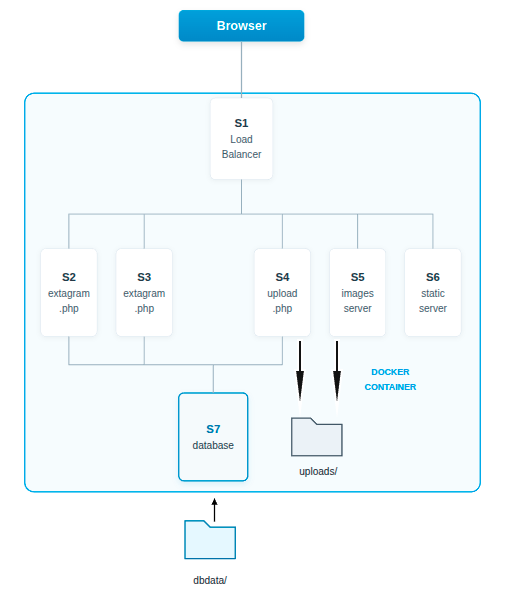

# Diagrama de Red

A continuación se muestra el diagrama de la arquitectura inicial de la red para el proyecto Extagram:

# Diagrama sprint2

Este diagrama muestra que todos los servidores están dockerizados y incluyen un proxy inverso (NGINX).Las fotos y los archivos PHP subidos se guardan en la carpeta `uplode`.

