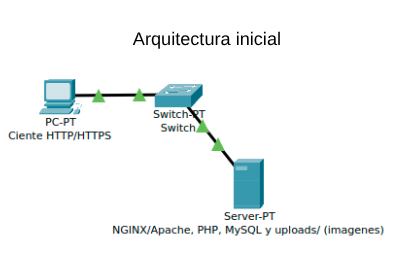
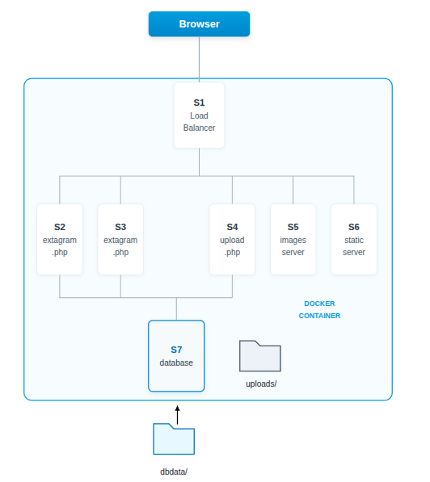

# Diagrama de Red

A continuación se muestra el diagrama de la arquitectura inicial de la red para el proyecto Extagram:

# Diagrama sprint2

Este diagrama muestra que todos los servidores están dockerizados e incluyen un proxy inverso (NGINX).

