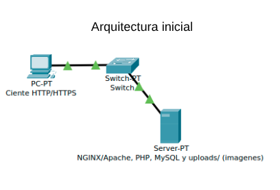
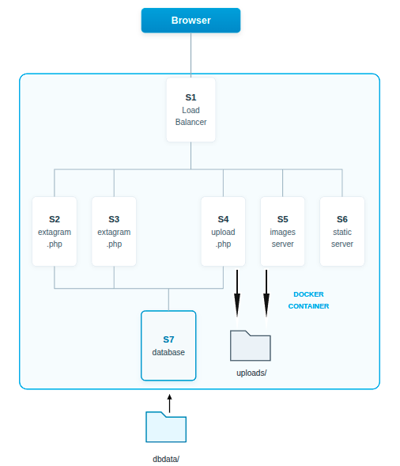
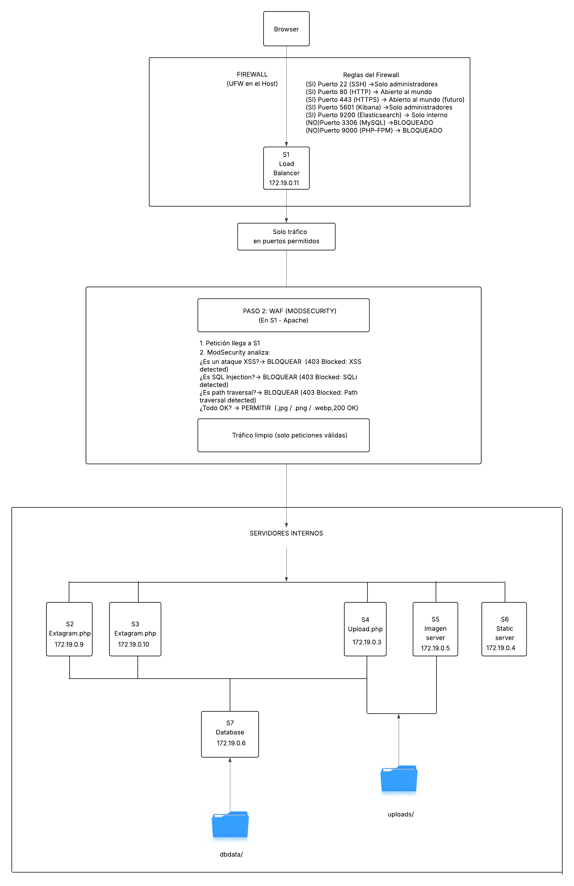

# Diagrama de Red

A continuación se muestra el diagrama de la arquitectura inicial de la red para el proyecto Extagram:

# Diagrama sprint2

Este diagrama muestra que todos los servidores están dockerizados y incluyen un proxy inverso (NGINX).Las fotos y los archivos PHP subidos se guardan en la carpeta `uplode`.

# Diagrama sprint 4

# Explicación del Diagrama de Seguridad - Sprint 4

---

## CAPA 1: FIREWALL (UFW en el Host)

### ¿Qué hace?
Actúa como la primera barrera de defensa. Controla qué tráfico puede entrar al servidor basándose en puertos.

### Reglas implementadas:

| Puerto | Servicio | Acceso | Uso |
|--------|----------|--------|-----|
| 22 | SSH | Permitido | Solo administradores |
| 80 | HTTP | Permitido | Todo el mundo |
| 443 | HTTPS | Permitido | Todo el mundo (futuro) |
| 5601 | Kibana | Permitido | Solo administradores |
| 9200 | Elasticsearch | Permitido | Solo comunicación interna |
| 3306 | MySQL | Bloqueado | Nadie desde fuera |
| 9000 | PHP-FPM | Bloqueado | Nadie desde fuera |

### Beneficio:
- Los atacantes no pueden acceder a puertos internos como MySQL
- Solo los puertos necesarios están visibles en internet

---

## CAPA 2: WAF MODSECURITY (en S1)

### ¿Qué hace?
Es la segunda barrera de defensa. Analiza el contenido de las peticiones para detectar y bloquear ataques.

### Reglas implementadas:

| ID | Ataque | Respuesta |
|----|--------|-----------|
| 1000 | XSS | 403 Blocked |
| 1001 | SQL Injection | 403 Blocked |
| 1002 | Path Traversal | 403 Blocked |
| 1005 | Archivos grandes | 413 Blocked |
| 1006 | Archivos peligrosos | 415 Blocked |

### Tráfico permitido:
- Imágenes: jpg, png, webp → 200 OK
- Páginas normales: extagram.php, upload.php → 200 OK

---

## SERVIDORES INTERNOS

Una vez que el tráfico pasa las dos capas de seguridad, llega a los servidores internos:

### Servidores de Aplicación:
- **S2** (172.19.0.9): Ejecuta extagram.php
- **S3** (172.19.0.10): Ejecuta extagram.php
- **S4** (172.19.0.3): Ejecuta upload.php

### Servidores Estáticos:
- **S5** (172.19.0.5): Servidor de imágenes
- **S6** (172.19.0.4): Servidor de archivos estáticos (CSS, SVG)

### Base de Datos:
- **S7** (172.19.0.6): Base de datos MySQL

---

## Flujo Completo de una Petición

1. Usuario hace clic en Extagram
2. Petición llega al servidor
3. Firewall verifica el puerto 80 y permite el paso
4. WAF en S1 analiza la petición en busca de ataques
5. Si no hay ataques, S1 envía la petición a S2 o S3
6. S2 consulta a S7 (MySQL) si necesita datos
7. Las imágenes se sirven desde S5
8. Los archivos CSS se sirven desde S6
9. El navegador recibe la página completa

---

## Resumen de Protección

| Capa | Protege contra |
|------|----------------|
| Firewall | Escaneo de puertos, accesos no autorizados |
| WAF | Ataques web: XSS, SQLi, path traversal |
| Red Interna | Aislamiento de servidores críticos |

---

## Ejemplo de Respuestas

| Petición | Respuesta | Motivo |
|----------|-----------|--------|
| extagram.com/ | 200 OK | Página normal |
| extagram.com/?q=<script> | 403 Blocked | Ataque XSS |
| extagram.com/?id=1' OR '1'='1 | 403 Blocked | SQL Injection |
| extagram.com/../../etc/passwd | 403 Blocked | Path traversal |
| extagram.com/foto.jpg | 200 OK | Imagen permitida |

---

## Conclusión
La infraestructura ahora es más segura gracias al firewall y el WAF. Los atacantes deben pasar dos barreras antes de llegar a los servidores internos, y cualquier intento de ataque es bloqueado y registrado.

- [index.md](../index.md)

