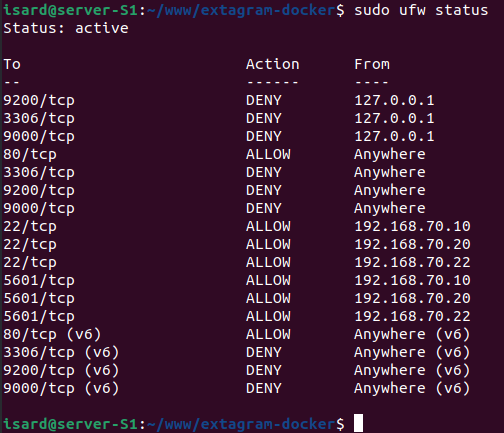

# Firewall davant de S1

## Objectiu

Implementar un firewall al servidor host mitjançant **UFW** per filtrar tràfic
no autoritzat abans que arribi a la infraestructura d'Extagram.

---

## Estat actual del firewall

## Anàlisi de les regles

### Ports oberts al públic
| Port   | Servei          | Motiu                   |
| ------ | --------------- | ----------------------- |
| 80/tcp | HTTP (nginx S1) | Accés públic a Extagram |

### Ports restringits a admins
| Port     | Servei | IPs permeses            |
| -------- | ------ | ----------------------- |
| 22/tcp   | SSH    | 192.168.70.10, .20, .22 |
| 5601/tcp | Kibana | 192.168.70.10, .20, .22 |

### Ports bloquejats totalment
| Port     | Servei        | Motiu                                   |
| -------- | ------------- | --------------------------------------- |
| 3306/tcp | MySQL (S7)    | Base de dades no accessible des de fora |
| 9200/tcp | Elasticsearch | Monitoratge no accessible des de fora   |
| 9000/tcp | PHP-FPM       | Serveis interns no exposats             |

- [index.md](../index.md)
